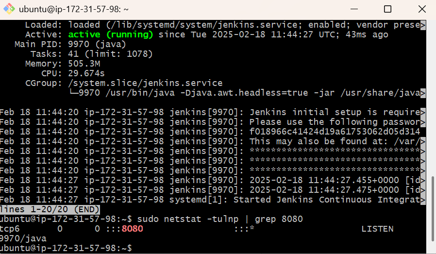
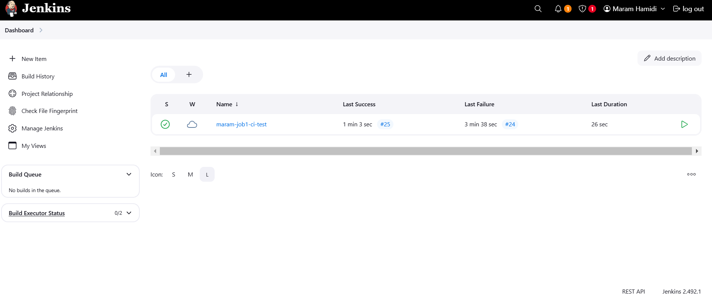
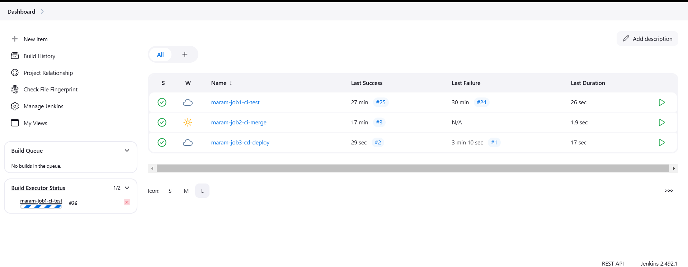
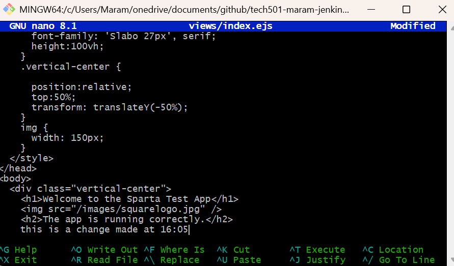

# Jenkins Setup on EC2 (Ubuntu 22.04)

## 1. Create an EC2 Instance
- **Operating System**: Ubuntu 22.04
- **Instance Type**: (`t3.micro`
- **Security Groups**: Open ports `22` (SSH), `8080` for jenkins server.
- **Launch EC2 Instance** using the **AWS Console**.
- Choose **Ubuntu 22.04** as the AMI (Amazon Machine Image).
- Set up SSH key pairs to securely access the instance.
## 2. Install Jenkins on EC2 (Ubuntu 22.04)

### Steps:
1. **SSH into the EC2 Instance**:
   ```bash
   ssh -i /path/to/your-key.pem ubuntu@<EC2_PUBLIC_IP>
# Update the System:
```bash
sudo apt update -y
sudo apt upgrade -y

# Install Java (Required for Jenkins): Jenkins requires Java to run. Install OpenJDK 11:
sudo apt install openjdk-11-jdk -y

# Add Jenkins' official repository and key to your system:

wget -q -O - https://pkg.jenkins.io/jenkins.io.key | sudo tee /usr/share/keyrings/jenkins.asc
echo deb [signed-by=/usr/share/keyrings/jenkins.asc] https://pkg.jenkins.io/debian/ stable main | sudo tee -a /etc/apt/sources.list.d/jenkins.list

#Install Jenkins:
sudo apt update -y
sudo apt install jenkins -y

#Start Jenkins:
sudo systemctl start jenkins

#Enable Jenkins to Start on Boot:

sudo systemctl enable jenkins

#Check Jenkins Status:

sudo systemctl status jenkins
``` 
- Access Jenkins Web Interface
- Access Jenkins via web browser:

- Open your browser and go to http://<EC2_PUBLIC_IP>:8080.
- Unlock Jenkins:

- You’ll be prompted to enter an unlock key. To find it, run the following command:
```bash
sudo cat /var/lib/jenkins/secrets/initialAdminPassword
```
- Install Suggested Plugins:

- After unlocking Jenkins, choose "Install Suggested Plugins" to install the necessary plugins.
- Create 3 Jenkins Jobs














