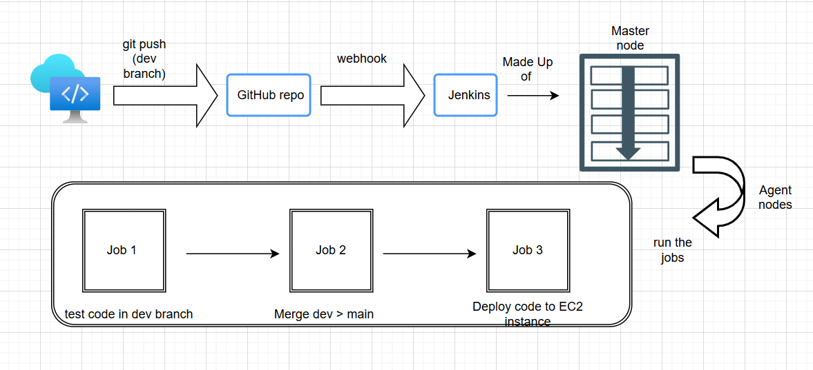
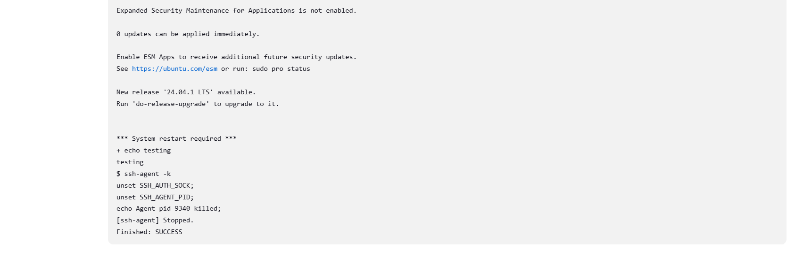

# How to Create a CI/CD Pipeline with Jenkins  

## Why Build a Pipeline?  
- Makes developers' lives easier  
- Quickly delivers changes to end users  
- Reduces the risk of big code changes breaking things  
- **Business Value:** Saves time and money by ensuring users get the latest features as soon as code changes happen  

---

## Why Use Jenkins Over Other Tools?  
- Jenkins is **not just a CI/CD tool**; it's an automation server  
- Free and open-source  
- Supports a vast ecosystem of plugins  

> **Note:**  
> Continuous **delivery** refers to deploying to a **testing/staging environment**, while continuous **deployment** involves pushing directly to **production**. Delivery requires approval before the next stage.  

---

## How to Build a Pipeline  
1. **On Jenkins**, create a new item  
2. Name the item and select **Freestyle Project**  
3. Click on the project and change the environment to **Bash**  
4. Upload your code (e.g., `uname -a`)  
5. Check if the pipeline is built successfully  

  

---

## Step 1: Create Job 1 - Connect to GitHub Repo  

### 1. Generate SSH Key Pairs (On Local Machine)  
```bash
ssh-keygen -t rsa -b 4096 -C "maramalhmaidi@gmail.com"
```
- Name it: `maram-jenkins-to-github-saap` on your local machine  

### 2. Add SSH Key to GitHub Repo  
- Go to **GitHub** → **Your Repo** → **Settings** → **Deploy Keys**  
- Paste the public key:  
```bash 
cat maram-jenkins-to-github-saap.pub
```  

### 3. Create a New Development Branch  
```bash
git checkout -b dev
```

### 4. Allow GitHub Webhooks  
- Add webhook:  
  - URL: `http://<jenkins-IP>/github-webhook/`  
  - Disable SSL verification  

### 5. Create Job 1 on Jenkins  
1. **Create new item**: `maram-job1-ci-test` (Freestyle project)  
2. **Discard old builds**: Set to 5  
3. **GitHub Project**: Add repo URL (`https://github.com/marmari9/tech501-maram-sparta-app-cicd/`)  
4. **Source Code Management**:  
   - Select **Git**  
   - Use SSH repo URL: `git@github.com:marmari9/tech501-maram-sparta-app-cicd.git`  
   - **Create new credentials** and add the **private key**  
   - Set **Branches to build** to `*/dev`  
5. **Build Environment**:  
   - Check **Provide Node and npm bin/folder to PATH**  
   - Select NodeJS version **20**  
6. **Build Step** (Run Secure Bash Shell)  
   ```bash
   cd app
   npm install
   npm test
   ```
7. **Post-Build Actions**:  
   - Build other projects **if stable**  
8. **Save & Build Now**  
9. **Check status and console output**  

  

---

## Step 2: Jenkins Job 2 - Git Checkout & Merge  

### 1. Create a New Job in Jenkins  
1. Go to **Jenkins Dashboard**  
2. Click **New Item** → Enter name (`maram-job2-ci-merge`)  
3. Select **Freestyle Project**  

### 2. Configure Source Code Management  
- **Git Repository URL**: `git@github.com:marmari9/tech501-maram-sparta-app-cicd.git`  
- Select **Git Credentials**  
- **Branch Specifier**: `dev`  
- **Additional Behavior:**  
  - Merge before build:  
    - **Name of repo:** origin  
    - **Branch to merge into:** main  
    - **Merge strategy:** default  
    - **Fast-forward mode:** `--ff`  

### 3. Post-Build Actions  
- **Git Publisher**:  
  - **Branch to push**: `main`  
  - **Target remote name**: `origin`  

---

## Step 3: Jenkins Job 3 - Continuous Deployment  

### 1. Create a New Job in Jenkins  
- **Name**: `maram-job3-cd-deploy`  
- **Type**: Freestyle Project  

### 2. Configure Source Code Management  
- **Git Repository URL**: `git@github.com:marmari9/tech501-maram-sparta-app-cicd.git`  
- **Select Git Credentials**  
- **Enable SSH Agent**:  
  - Select `maram-ec2 (EC2 access)`  
  - Ensure EC2 Security Group allows SSH  

### 3. Set Build Triggers  
- Select **GitHub hook trigger for Git SCM polling**  

### 4. Add Build Step (SCP & SSH Commands)  
```bash
# Copy the app files to EC2
scp -i /var/jenkins/keys/maram-key-3.pem -r /var/jenkins/workspace/maram-job3-cd-deploy/app/* ubuntu@3.255.128.209:/app/

# Install dependencies and restart the app on EC2
ssh -i /var/jenkins/keys/maram-key-3.pem ubuntu@3.255.128.209 << 'EOF'
cd /app
npm install
pm2 start app.js
EOF
```  

### 5. Troubleshooting SSH Agent Issues  
**Error: SSH Permission Denied**  

**Potential Fixes Tried:**  
```bash
scp -o StrictHostKeyChecking=no -r /var/jenkins/workspace/maram-job1-ci-test/app ubuntu@3.255.128.209:/home/ubuntu/repo
ssh ubuntu@3.255.128.209 << 'EOF'
cd ~/app
npm install
npm start
pm2 start app.js
EOF
```  

  

---

## Testing Changes on the App Webpage 
- on the app repo make changes and test the pipeline trigger:
 
```bash
nano app/views/index.ejs
```  
- These changes should trigger **Job 1 → Job 2 → Job 3** in Jenkins **automatically**  
- Refresh the app webpage; changes should be visible  

---
